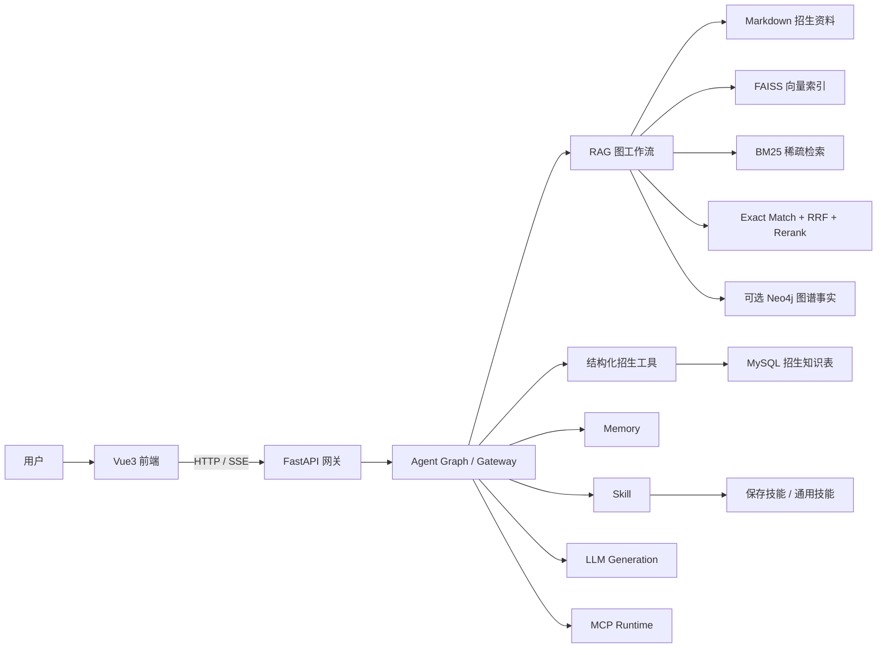

# 招生咨询系统项目架构与技术栈分析

## 1. 项目定位与论文写作口径

本项目是一个面向高校招生咨询场景的智能问答系统 MVP，核心目标不是“做一个能聊天的大模型页面”，而是围绕招生政策、专业信息、录取规则、学费资助、报到流程等高频问题，构建一条“证据可追溯、流程可编排、服务可降级”的咨询链路。

从代码现状看，系统已经稳定落地的主链路包括：

- 前端多会话对话界面、流式响应展示和运维面板。
- FastAPI 网关统一接入。
- 本地 RAG 检索与结构化招生数据查询。
- 专家模式下的子问题拆分、计划执行、步骤回放。
- 记忆、技能、引用校验、熔断降级、健康检查、评测门禁。

论文中不宜写死为“完整自治智能体平台”或“稳定联网搜索系统”，更准确的表述应是：

- 当前系统已形成“本地知识库 RAG + 结构化查询 + 会话记忆 + 专家模式编排 + 质量保障”的稳定主链路。
- MCP 外部工具和联网能力属于可扩展能力，是否实际参与回答取决于 MCP 配置与运行环境。
- Docker Compose 中的 `postgres`、`redis` 属于部署层预留组件，不等于当前主代码已经把它们接入业务主链路。

## 2. 总体架构

### 2.1 架构风格

系统整体采用“前后端分离 + 网关编排 + 可拆分能力服务 + 本地知识增强”的混合架构。

- 前端负责模式切换、消息渲染、SSE 流式消费和运维交互。
- 后端网关负责统一接收请求、输入输出审查、能力路由、状态汇总与结果回放。
- RAG、记忆、技能、生成等能力既支持进程内直接调用，也支持通过 HTTP 拆成独立服务。
- 结构化招生知识与非结构化文档知识并行存在，分别服务于“精确字段问答”和“综合政策说明”。

### 2.2 分层说明

1. 表现层：`frontend/`，负责会话 UI、模式切换、健康状态展示、索引重建和上下文压缩。
2. 接入层：`backend/app/main.py`，负责 API、SSE、管理接口和健康检查。
3. 编排层：`backend/app/services/gateway.py`、`agent_graph.py`、`agent_runtime.py`，负责路由、子问题拆分、计划执行和降级。
4. 能力层：RAG、结构化招生查询、技能执行、记忆管理、生成服务、MCP 工具运行时。
5. 数据层：Markdown 知识库、FAISS 索引、BM25 索引、MySQL 结构化表、可选 Neo4j 图谱。

### 2.3 实际架构图

## 3. 前端架构分析

### 3.1 技术栈

前端采用 `Vue 3 + TypeScript + Vite`，依赖规模很克制，没有引入重量级 UI 框架，说明项目重点是把问答链路跑稳，而不是堆花里胡哨的界面库。

| 技术 | 作用 | 在本项目中的具体价值 |
| --- | --- | --- |
| Vue 3 | 构建单页应用 | 组件化拆分清晰，适合对话区、侧边栏、右面板这种中等复杂度界面 |
| TypeScript | 类型约束 | 对 `ChatRequest`、`AgentStepEvent`、`HealthResponse` 这类前后端契约对象做显式约束 |
| Vite | 本地开发与打包 | 冷启动快，适合课程项目和快速迭代 |
| Markdown-it | 回答渲染 | 支持模型输出 Markdown 内容 |
| Mermaid | 图示渲染 | 方便展示流程图、结构图，适合论文截图或系统展示 |

### 3.2 页面与组件职责

- `App.vue`：会话总控，负责消息状态、流式拼接、发送请求、会话切换、错误提示。
- `ModeSelector.vue`：切换 `chat / rag / agent` 三种模式。
- `RightPanel.vue`：调整模型参数、切换专家策略、查看健康状态、重建索引、压缩上下文。
- `services/api.ts`：封装普通 HTTP 和 SSE。
- `utils/requestBuilder.ts`：将界面模式翻译成后端特性组合。

### 3.3 前端交互设计特点

前端不是简单文本框加发送按钮，而是显式把“系统状态”暴露给用户：

- 支持多会话管理。
- 支持步骤事件 `step` 的流式回放，用户可看到专家模式的执行过程。
- 支持健康检查、索引重建、上下文压缩。
- 专家模式下支持 `speed / quality` 两种执行策略。

从论文角度，这说明系统界面不是单纯“问答展示层”，而是承担了“可观测的人机协同界面”角色。

## 4. 后端核心架构分析

### 4.1 FastAPI 网关

后端入口为 `backend/app/main.py`。FastAPI 的价值不只是“写接口方便”，更关键的是：

- 适合定义清晰的请求响应模型。
- 便于同时提供普通接口和 SSE 流式接口。
- 天然适合做管理端点，如健康检查、索引重建、运维指标输出。

主接口包括：

- `/api/chat`
- `/api/chat/stream`
- `/api/features`
- `/api/mcp/tools`
- `/api/skills/saved`
- `/api/memory/compress`
- `/api/admin/metrics`
- `/api/admin/reindex`
- `/healthz`

### 4.2 Pydantic 与配置管理

系统使用 `Pydantic 2` 和 `pydantic-settings` 管理请求模型、状态模型和 `.env` 配置：

- `ChatRequest` 会自动补齐特性依赖，例如 `citation_guard -> rag`、`use_saved_skill -> skill_exec`。
- `Settings` 统一管理模型地址、Embedding、Rerank、RAG 参数、微服务地址、MySQL、Neo4j、MCP 配置。
- 配置层还实现了“本地 LLM 不可达时自动回退到 API_URL”的逻辑，说明项目考虑了实验环境不稳定这一现实问题。

### 4.3 网关编排器的角色

`GatewayOrchestrator` 是后端真正的大脑，不是简单控制器。

它负责：

- 输入安全审查。
- Query Router 路由。
- 短期/长期/特殊记忆装载。
- 按特性顺序调度 `rag / skill_exec / use_saved_skill / citation_guard`。
- 记录 `tool_audit`、`trace_id`、降级状态。
- 对输出再做一次敏感信息审查。

这里体现的是典型的工程思想：把“调用模型”从系统中心降级为一个步骤，而不是让大模型直接统治整个后端。

## 5. 技术栈逐项分析

### 5.1 前端技术

#### Vue 3

项目没有使用 Vue 生态里复杂的状态管理库，而是依赖组件状态和组合式 API 完成会话管理。这符合 MVP 阶段的 KISS 原则：当前业务复杂度还没有高到必须上 Pinia/Vuex。

#### TypeScript

TypeScript 在本项目里的价值不是“时髦”，而是直接约束：

- 模式枚举 `chat / rag / agent`
- 降级状态 `ok / degraded / failed`
- 步骤状态 `started / completed / retrying / degraded / failed`
- SSE 事件载荷结构

这能减少前后端字段不一致导致的低级错误。

#### Vite

Vite 负责开发服务器和生产构建。对于一个需要频繁修改前端交互、样式和 SSE 调试的毕业设计项目，Vite 的高反馈速度比复杂工程能力更重要。

### 5.2 后端技术

#### FastAPI

FastAPI 适合这个项目的原因有三点：

- 既能处理常规 JSON API，也能处理流式返回。
- 与 Pydantic 配合紧密，接口契约清楚。
- 天然适合拆成多个轻量服务应用。

#### HTTPX

HTTPX 用于服务间调用和依赖探测。系统并非死绑本地调用，而是通过 `service_call_mode=local|http` 支持两种运行方式，这说明项目在设计上保留了从单进程向服务化迁移的能力。

#### OpenAI Python SDK

生成服务通过 OpenAI 兼容接口访问模型。它不是写死某家服务商，而是通过 `base_url + api_key` 组合做兼容接入，这样做的好处是实验环境可以灵活切换模型源。

#### Generation Cache

生成服务内置短 TTL 提示缓存，同问题、同上下文和同参数下可以命中缓存，降低重复生成成本。这一点对课程项目尤其现实，因为模型调用成本和延迟都不是闹着玩的。

### 5.3 AI 与 RAG 技术

#### LangChain

LangChain 在本项目中主要承担三类工作：

- 查询改写 Prompt 组织。
- 文档对象与切块处理。
- 与 LangGraph、MCP 工具适配器衔接。

它在这里更像“组件装配层”，而不是系统主逻辑本身。

#### LangGraph

LangGraph 被用于两处：

1. RAG 图工作流编排。
2. 专家模式的能力规划与多步骤执行图。

这样设计的意义是：把链路显式拆成节点，而不是写成一大坨 if/else。论文里可以强调“流程可视、节点可控、便于插入质量闸门与降级逻辑”。

#### OpenAICompatibleEmbeddings

系统没有直接把 Embedding 死绑到某个 SDK，而是自己封装了 OpenAI 兼容 Embedding 客户端。更关键的是：

- 远程 Embedding 可用时走标准接口。
- 不可用时可降级为本地伪向量，保证 FAISS 构建和离线演示不至于直接瘫痪。

这属于典型的“保底不保真，但保可运行”设计。

#### FAISS

FAISS 是当前主向量索引。它的优势是：

- 本地部署简单。
- 对中小规模院校招生语料足够。
- 与 LangChain 生态衔接方便。

系统还通过 `manifest.json` 校验文档指纹、切块参数和文件列表，防止误加载旧索引，这个细节很适合写进论文，因为它体现了索引新鲜度管理，而不是“建一次索引永远用”。

#### BM25

BM25 用于补足纯向量检索对数字、条款号、费用词等硬约束不敏感的问题。项目里 BM25 共享实例还加了锁，说明作者考虑了并发查询时的状态安全。

#### Exact Match + RRF

系统不是“向量一把梭”。它还做了：

- 精确匹配通道：处理年份、分数、金额、联系方式等硬约束。
- RRF 融合：统一整合 Dense、Sparse、Exact 三路结果。

这对招生问答非常关键，因为用户问“5500 元”“2025 年河南理科”“软件工程专业代码”这类问题时，纯语义检索很容易跑偏。

#### Rerank

系统使用远程 `/rerank` 接口做重排，默认模型为 `BAAI/bge-reranker-v2-m3`。若远程不可用，则回退到启发式排序。这样做的好处是：

- 正常情况下可以提升证据排序质量。
- 异常情况下不会因为重排挂掉而让整条回答链路失效。

#### Neo4j

Neo4j 在当前系统中是“可插拔增强层”，不是主链路硬依赖。只有当图数据库配置齐全时，系统才会把图谱事实拼接进上下文。

论文里应写成：

“系统预留了知识图谱增强接口，可在需要时将节点关系事实补充到检索上下文中。”

而不是写成“系统已经全面依赖图谱驱动回答”，那就吹过了。

### 5.4 数据处理与结构化知识技术

#### python-docx / PyPDF2 / openpyxl / xlrd

这些库的作用很朴素，但在招生系统里极其实际：

- `python-docx` 处理招生章程 DOCX。
- `PyPDF2` 处理 PDF。
- `openpyxl` 处理 XLSX。
- `xlrd` 处理历史 XLS。

项目并没有逃避“真实资料格式很乱”这个问题，而是正面把多格式源文件纳入数据处理链路。

#### PyMySQL + MySQL

结构化知识当前主落点是 MySQL，不是 Compose 里那个 PostgreSQL。MySQL 表包括：

- `documents`
- `major_catalog`
- `score_lines`
- `policy_tables`
- `faq_seed`
- `parse_runs`

这意味着系统对“学费、学制、选科、分数线、位次、附表字段”等问题，并不是只靠 RAG 模糊搜，而是提供了结构化查询主链路。

## 6. RAG 工作流详细分析

### 6.1 文档入库与切块

RAG 语料主来源是 `docs/` 下的 Markdown 化招生资料。`RagIngestor` 的处理过程不是单层切块，而是：

1. 读取文档元数据，如来源 URL、标题、发布日期、主题。
2. 先做较大的父块切分。
3. 为每个父块生成摘要层 `summary` 文档。
4. 再生成小块 `small` 文档。
5. 为小块补充 `section_hint`、`parent_text`、`query_expansions` 等增强信息。

这实际上是 Small2Big 思路：先有摘要导航层，再有细粒度证据层。

### 6.2 检索主链路

RAG 图工作流节点顺序如下：

1. `normalize_query`
2. `route_query`
3. `rewrite_query`
4. `hybrid_retrieve`
5. `dedupe_and_merge`
6. `rerank_docs`
7. `resolve_conflicts`
8. `quality_gate`
9. `retry_retrieve`
10. `citation_guard`
11. `build_context`
12. `finalize`

这条链路的关键点有三处：

- 先路由问题类型，再决定检索深度，避免所有问题都重检索。
- 先冲突裁决和质量闸门，再进入引用校验，防止错误证据先污染答案。
- 覆盖度低、空召回或证据过旧时，还会做一次更保守的二次检索。

### 6.3 时效性与冲突处理

项目针对招生场景的时效问题做了专门设计：

- 时效问题会优先匹配年份、有效期和公告类文档。
- 如果前几条证据出现多个年份冲突，会触发冲突检测。
- 若能根据来源权威性和时间裁决，则保留裁决后的证据。
- 若无法裁决，则进入保守降级。

这比普通课程项目常见的“召回几段就生成”明显更工程化。

### 6.4 本地保底能力

RAG 还有两层特别实用的保底：

- FAISS 不可用时，可退回本地向量相似度检索。
- 对“院长是谁、电话多少、联系方式是什么”这类精确事实问题，若 RAG 低分降级，还会尝试本地 Markdown 精确扫描补救。

这部分很适合写进论文的“可靠性设计”。

## 7. 结构化招生知识与数据工作流

### 7.1 路由逻辑

结构化路由器会识别三类问题：

- 分数线/位次类：`scoreline_lookup`
- 学费/选科/学制/专业代码类：`major_catalog_lookup`
- 章程附表类：`policy_table_lookup`

这说明系统实际上采用了“规则路由 + 结构化检索 + RAG 兜底”的混合方案。

### 7.2 数据构建流程

`build_admissions_kb.py` 负责：

1. 建表。
2. 从原始 DOCX/PDF/XLS/XLSX 中解析数据。
3. 导出章程附表衍生 Excel。
4. 写入 MySQL 主表。
5. 记录 `parse_runs` 作为解析审计。

这条链路非常适合在论文中归入“知识库构建与数据预处理流程”。

### 7.3 结构化查询的保底策略

结构化工具不是完全依赖 MySQL：

- 正常情况下优先走 MySQL。
- MySQL 异常或无结果时，会回退到本地缓存文件检索。
- 最终结果还能包装成 RAG 风格上下文，继续并入统一回答链路。

这说明结构化查询模块和 RAG 并不是割裂的两套系统，而是已经在接口层完成了统一。

## 8. 专家模式与工作流设计

### 8.1 专家模式的真实含义

前端的专家模式会默认带上 `rag + web_search + skill_exec + citation_guard`，但需要强调：

- 当前后端公开的受控工具目录以本地 RAG、技能、记忆、结构化查询和 MCP 路由为主。
- `web_search` 在当前版本不是默认稳定主链路能力。
- 真正的外部工具能力取决于 MCP 配置是否成功加载。

因此，论文里更稳妥的定义应是：

“专家模式是一个多能力编排入口，优先使用本地知识、结构化工具、记忆和可用的 MCP 工具协同完成复杂咨询任务。”

### 8.2 Agent Graph 工作流

专家模式下，`AgentGraphRunner` 的执行顺序为：

1. 加载会话记忆。
2. 查询前处理与路由。
3. 子问题拆分。
4. 为每个子问题构建计划。
5. 并行执行计划步骤。
6. 审查步骤结果。
7. 需要时重试或重规划。
8. 合并子问题结果。
9. 生成最终答案。
10. 异步收尾与状态持久化。

它的亮点在于：

- 支持子问题并行处理。
- 每一步都有 `step` 事件可回放。
- `speed` 策略偏向少重试、快返回。
- `quality` 策略允许更多重试和一次重规划。

### 8.3 查询改写与计划生成

专家模式不是原问题直接丢给模型，而是先做：

- 基于记忆的查询改写。
- 针对复合问题的拆分。
- 为子问题构建计划步骤。

即便没有可用 LLM，也有规则化回退逻辑，保证系统不是“没模型就瘫”。

### 8.4 记忆设计

记忆分为三类：

- 短期记忆：当前轮相关上下文。
- 长期记忆：滚动摘要 `rolling_summary`。
- 特殊记忆：如“偏好简短回答”“偏好分点”。

当前实现是进程内内存，并带过期时间，属于 MVP 级实现。优点是简单直接，缺点是跨实例共享和持久化能力不够。

### 8.5 技能设计

技能模块支持：

- 技能保存。
- 基于哈希的版本去重。
- 自动激活评分最高版本。
- 通用技能执行与历史技能执行。

不过要实话实说：当前技能更偏“规则化封装的能力说明”，不是完全自治的工具学习系统。论文里写成“技能化扩展机制”是对的，写成“自进化专家系统”就过火了。

## 9. 测试流程与质量保障

### 9.1 单元与集成测试

后端测试覆盖面较广，至少包括：

- API 与 SSE 回放。
- RAG 索引、检索、消融实验。
- Agent Runtime 与专家模式。
- 结构化招生工具。
- 熔断并发。
- 管理接口与权限。
- 评测脚本与发布门禁。

前端使用 `Vitest`，覆盖消息渲染、请求构造、API 服务和右侧面板等核心逻辑。

### 9.2 评测脚本

系统并没有停留在“测试能跑就算了”，还做了评测：

- `evaluate_gateway.py` 会构造多类用例，包括普通 RAG、时效问题、技能降级、保存技能缺失、生成失败。
- 输出指标包括通过率、引用命中率、P95 延迟、hard case 通过情况。

这说明项目已经开始把“回答质量”从主观感受转为可量化指标。

### 9.3 发布门禁

`gate_release.py` 会根据评测报告判断：

- 通过率是否达标。
- 引用命中率是否达标。
- P95 延迟是否超标。
- `failed` 行数是否过多。
- 相比基线是否出现明显回归。

这在毕业设计里已经属于比较完整的工程化闭环了。

## 10. 保底措施与鲁棒性设计

这一部分是本项目最值得写进论文亮点的内容之一。

### 10.1 熔断与隔离

`IsolationExecutor` 对 RAG、记忆、技能等依赖调用统一做：

- 失败计数。
- 连续失败熔断。
- 短时间打开电路避免雪崩重试。
- 恢复后自动复位。

### 10.2 输入输出安全审查

网关会拦截：

- 提示词泄露请求。
- 绕过规则请求。
- 输出中的内部提示词和疑似密钥片段。

这类机制对于答辩时解释“如何避免被恶意提问套出系统内部信息”非常有用。

### 10.3 引用校验与保守回答

系统通过 `CitationGuard` 和 `RetrievalQualityGate` 控制：

- 来源数量是否足够。
- Top1 分数是否太低。
- 覆盖度是否过低。
- 是否存在冲突证据。
- 时效证据是否已过期。

如果证据不足，系统会降级而不是硬编答案。

### 10.4 规则化最终回答兜底

专家模式在最终生成阶段超时或失败时，不会假装“已经完整回答”，而是基于已获取的上下文和步骤备注生成规则化保守汇总。这一点非常重要，因为它体现了“失败时不造假”。

### 10.5 多层降级链

当前可确认的降级链包括：

- 结构化查询失败 -> 回退本地缓存。
- Rerank 失败 -> 回退启发式重排。
- FAISS 不可用 -> 回退本地向量相似度。
- BM25 不可用 -> 回退本地词重叠检索。
- RAG 低分精确事实问题 -> 回退本地文档精确扫描。
- LLM/Embedding/Rerank 远端不可用 -> 走本地或规则化保底。

## 11. 当前不足与论文中应如实说明的问题

1. 记忆仍以进程内存为主，缺少真正的分布式共享与持久化。
2. Compose 中 `postgres`、`redis` 尚未完全进入业务主链路。
3. 外部 MCP 工具和联网能力存在，但受配置与运行环境约束，不应写成默认稳定能力。
4. 技能执行当前仍偏模板化和规则化，自治程度有限。
5. Neo4j 为可选增强，不是当前稳定主链路必经步骤。

## 12. 论文建议写法

建议在正文中采用以下口径：

- 把“已稳定实现能力”和“预留扩展能力”分开写。
- 把“专家模式”写成多能力编排机制，不要写成全自动联网自治代理。
- 把“RAG”写成工程化混合检索与质量控制链，而不是普通向量检索。
- 把“系统亮点”重点放在证据约束、结构化查询、降级策略和测试门禁，而不是模型名字本身。

## 13. 结论

总体来看，该项目的价值不在于单点技术多新，而在于它把招生咨询这个高谨慎业务场景拆成了几条可解释的工程链路：

- 用混合检索和结构化查询解决“答得准”的问题。
- 用 LangGraph 和专家模式解决“复杂问题怎么拆、怎么做”的问题。
- 用引用校验、质量闸门、熔断、规则兜底解决“出问题时别胡说”的问题。
- 用测试、评测、门禁和运维接口解决“系统怎么稳定迭代”的问题。

从毕业设计视角看，这种“业务场景 + AI 能力 + 工程可靠性”三者结合的实现方式，比单纯堆模型名更有分析价值。
